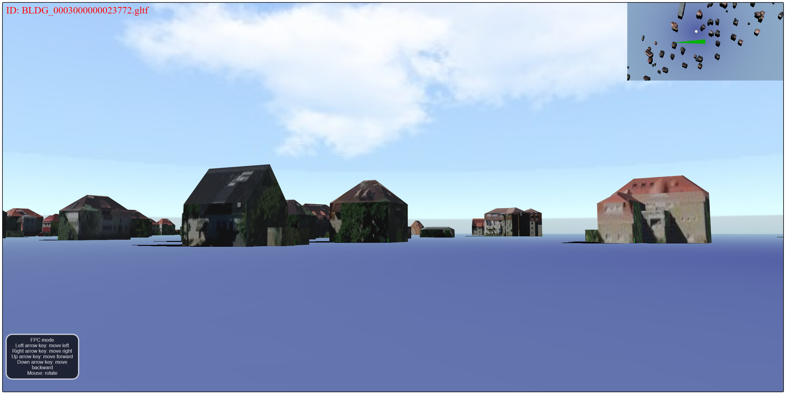

# Cesium + Babylonjs 3D 城市探索游戏

## 简介
玩家在第一页随便点一个地方，即可标记。

随后可跳转到 Babylonjs 构建的 3D 场景中。

1.第一视角人物可以移动、调转方向。

2.右上角有小地图（Babylon里面没有原生提供小地图，我自行实现的）。

3.人物和房屋发生接触时，左上角会显示房屋信息

## 运行

强烈建议使用 VSCode + CodeSpace 运行。

请首先确保自己安装了 CodeSpace 插件

基础步骤：创建 CodeSpace -> `pnpm prep` ->  `pnpm build` -> `pnpm dev` -> F5 开始调试

## 技术亮点
1. 实作了一个 Babylonjs 应用
2. 实现小地图，实现小地图指南针
3. 大型数据集加载
4. 区域分块加载（将全局分割为瓦片方块，用户指定经纬度，然后计算经纬度处于哪个瓦片之中，只加载当前瓦片内的建筑）
